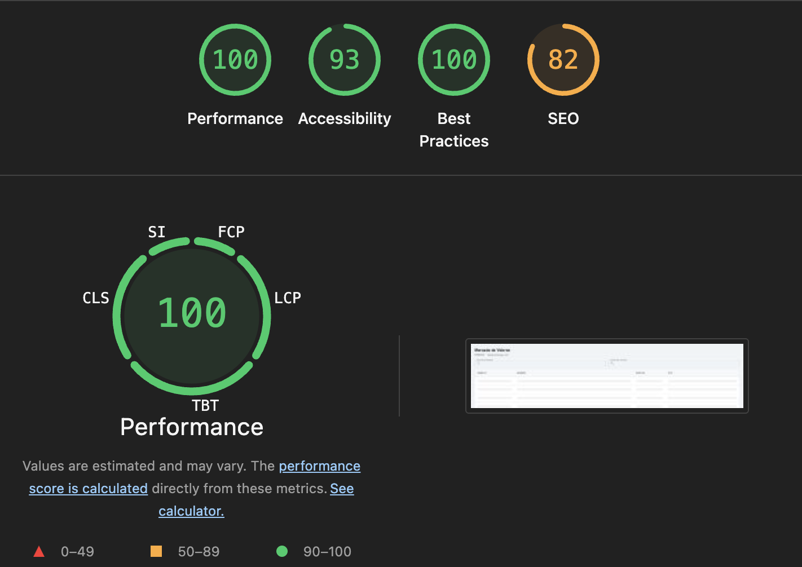
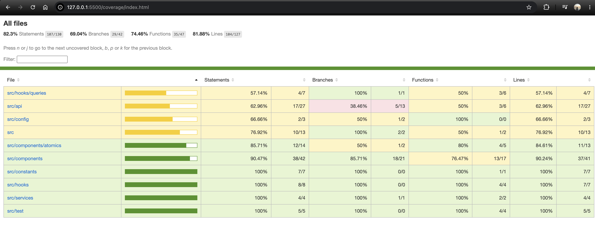

# 📈 Metafar Challenge — Mercado de Valores

Refactorización completa de una aplicación React de mercado de valores, implementando arquitectura moderna con React Query, optimizaciones de performance y mejoras de UX/UI.

## 🚀 Setup

### Requisitos
- Node.js 18+
- npm

### Instalación

```bash
git clone https://github.com/LedesmaCristian/metafar-challenge
cd metafar-challenge
npm install
```

### Variables de entorno

```bash
cp .env.example .env
```

Completar `VITE_TWELVE_DATA_API_KEY` con una API key de [Twelve Data](https://twelvedata.com/) (plan gratuito disponible).

### Comandos

| Comando | Descripción |
|---------|-------------|
| `npm run dev` | Servidor de desarrollo |
| `npm run build` | Build de producción |
| `npm run lint` | Verificar errores de ESLint |
| `npm run lint:fix` | Corregir errores automáticamente |
| `npm run format` | Formatear código con Prettier |
| `npm run test` | Correr tests en modo watch |
| `npm run test:coverage` | Reporte de cobertura |

---

## 🏗️ Arquitectura

```
src/
├── api/
│   ├── ApiError.ts      # Custom error class para errores de API
│   ├── client.ts        # Instancia de axios con interceptors y retry
│   ├── endpoints.ts     # Constantes de endpoints
│   └── types.ts         # Tipos TypeScript de Twelve Data API
├── components/
│   ├── atomics/         # Componentes reutilizables (TableHeader, TableRow)
│   ├── Detail.tsx       # Página de detalle de acción
│   ├── StockChart.tsx   # Gráfico de precios con Highcharts
│   ├── StockPreferenceForm.tsx  # Formulario de configuración
│   └── StockTable.tsx   # Tabla virtualizada de acciones
├── config/
│   └── env.ts           # Validación y tipado de variables de entorno
├── constants/
│   └── index.ts         # Constantes globales (intervalos, exchanges, rutas)
├── hooks/
│   ├── queries/
│   │   ├── queryKeys.ts     # Query Keys Factory (patrón)
│   │   ├── useStockList.ts  # Lista de acciones con caché Infinity
│   │   ├── useStockQuote.ts # Time series con refetch dinámico
│   │   ├── useStockData.ts  # Datos básicos de una acción
│   │   └── useStockSearch.ts # Búsqueda con debouncing
│   └── useDebounce.ts   # Hook de debounce reutilizable
├── services/
│   ├── stockService.ts  # Funciones de fetching para stocks
│   └── quoteService.ts  # Funciones de fetching para quotes
├── test/
│   ├── setup.ts         # Configuración de testing
│   └── utils.tsx        # renderWithProviders helper
├── theme.ts             # Tema global de MUI
└── main.tsx             # Entry point con providers
```

---

## ⚡ React Query — Decisiones técnicas

### Por qué React Query

Reemplaza el patrón `useEffect + useState` manual que tenía el proyecto original, eliminando:
- Llamadas duplicadas a la API (el proyecto original hacía 2 requests a `/stocks` en cada carga)
- Manejo manual de estados loading/error en cada componente
- Ausencia de caché (cada navegación volvía a fetchear todo)

### Query Keys Factory

Implementamos el patrón Query Keys Factory en `hooks/queries/queryKeys.ts` para tener una única fuente de verdad para todas las cache keys, evitando strings hardcodeados dispersos en el código:

```typescript
queryKeys.stocks.list('NASDAQ')        // ['stocks', 'list', 'NASDAQ']
queryKeys.quotes.timeSeries('AAPL', '5min')  // ['quotes', 'timeSeries', 'AAPL', '5min', ...]
```

### Estrategia de caché por tipo de dato

| Tipo de dato | staleTime | Justificación |
|---|---|---|
| Lista de stocks (NASDAQ) | `Infinity` | Datos estáticos, no cambian durante la sesión |
| Datos de una acción | `Infinity` | Nombre y moneda no cambian |
| Series históricas | `5 min` | Datos del pasado, no se modifican |
| Datos en tiempo real | `0` + `refetchInterval` dinámico | Requieren actualización constante |
| Búsquedas | `1 min` | Caché corto para evitar requests repetidos |

### Prefetching on hover

Al pasar el cursor sobre una fila de la tabla, se precarga el detalle de esa acción usando `queryClient.prefetchQuery()`. Cuando el usuario hace click, los datos ya están en caché y la navegación es instantánea.

### Horarios de mercado y tiempo real

El modo tiempo real usa `refetchInterval` dinámico según el intervalo seleccionado.
Es importante considerar que la API de Twelve Data solo devuelve datos actualizados
durante el horario de mercado de NASDAQ:

- **Horario regular**: Lunes a viernes, 9:30 AM - 4:00 PM ET (Eastern Time)
- **Pre-market**: 4:00 AM - 9:30 AM ET
- **After-hours**: 4:00 PM - 8:00 PM ET

Fuera de estos horarios, el gráfico en modo "Tiempo Real" mostrará los últimos
datos disponibles del cierre anterior. Esto es comportamiento esperado de la API,
no un bug de la aplicación.

---

## 🔧 Optimizaciones de Performance

### 1. Virtualización de tabla
- **Antes**: Los 4.483 stocks de NASDAQ se renderizaban todos en el DOM
- **Después**: Solo ~12 filas visibles con `@tanstack/react-virtual`
- **Impacto**: Reducción drástica del tiempo de render inicial y uso de memoria

### 2. Code splitting con React.lazy
- `StockTable`, `Detail` y `StockChart` se cargan en chunks separados
- Highcharts (librería pesada ~2MB) tiene su propio chunk lazy-loaded
- El bundle inicial es significativamente más liviano

### 3. Memoización estratégica
- `React.memo` en `TableRow` y `StockChart` — evita re-renders cuando las props no cambian
- `useMemo` para el filtrado de 4.483 stocks — solo se recalcula cuando cambia el término de búsqueda
- `useCallback` para handlers — estabiliza referencias para que `React.memo` funcione correctamente

### 4. Axios retry con backoff exponencial
- Configurado con `axios-retry`: 3 reintentos automáticos
- Solo reintenta errores de red y 5xx — los 4xx no se reintentan (son errores del cliente)
- Backoff exponencial para no saturar la API

---

## 📊 Métricas de Performance

### Lighthouse Score (Build de producción)



| Métrica | Score |
|---------|-------|
| Performance | 🟢 100 |
| Accessibility | 🟢 93 |
| Best Practices | 🟢 100 |
| SEO | 🟠 82 |
| First Contentful Paint | 🟢 0.4s |
| Largest Contentful Paint | 🟢 0.4s |
| Total Blocking Time | 🟢 0ms |
| Cumulative Layout Shift | 🟢 0 |
| Speed Index | 🟢 0.4s |

### Bundle size (producción)

| Chunk | Tamaño | Gzip | Carga |
|-------|--------|------|-------|
| index.js | 294 kB | 97 kB | Inicial |
| StockTable.js | 185 kB | 59 kB | Lazy |
| StockChart.js (Highcharts) | 288 kB | 107 kB | Lazy |
| Detail.js | 26 kB | 8 kB | Lazy |

> StockChart (Highcharts) solo se descarga cuando el usuario navega al detalle.
> Detail bajó de 315 kB a 26 kB (-91%) al separar Highcharts en su propio chunk.

### Cobertura de tests



| Métrica | Cobertura |
|---------|-----------|
| Statements | 82.3% |
| Branches | 69.04% |
| Functions | 74.46% |
| Lines | 81.88% |

---

## 🛡️ TypeScript y Type Safety

- Modo estricto habilitado (`strict`, `noImplicitAny`, `noUnusedLocals`, `exactOptionalPropertyTypes`)
- Tipos completos para todas las respuestas de Twelve Data API
- `ApiError` custom class con `status`, `code` y `message` tipados
- Validación de variables de entorno al inicio de la app — falla rápido si falta la API key
- Path aliases con `@/` para imports limpios

---

## 🧪 Testing

Configurado con **Vitest** + **React Testing Library**.

### Qué se testea
- `helpers.ts` — función `intervalToMs` con todos los intervalos
- `src/api/` — `ApiError` class e interceptors de `client.ts`
- `src/services/` — `getStocks` y `searchSymbols`
- `src/hooks/queries/` — `useStockList` (loading, data, error, staleTime)
- `src/components/` — `StockTable` (skeleton, error, data, filtros)

### Qué no se testea (y por qué)
- `StockChart` — requiere mock complejo de Highcharts, ROI bajo
- `Detail.tsx` — componente de integración, cubierto indirectamente por los tests de hooks
- Interceptors completos de axios — parcialmente cubiertos, la lógica crítica está en los tests de servicios

---

## 📋 Mejoras implementadas vs código original

| Aspecto | Antes | Después |
|---------|-------|---------|
| Gestión de datos | `useEffect` + `useState` manual | React Query con caché estratégico |
| Llamadas duplicadas | 2 requests a `/stocks` por carga | Request deduplication automática |
| Renderizado de tabla | 4.483 nodos en el DOM | ~12 nodos visibles (virtualización) |
| Bundle | Monolítico | 3 chunks lazy-loaded |
| API key | Hardcodeada en el código fuente | Variables de entorno con validación |
| Manejo de errores | Sin feedback al usuario | Error boundaries + Alert con retry |
| Estados de carga | Spinner básico | Skeleton loaders por sección |
| UI | Básica sin diseño | Tema MUI, chips, breadcrumbs, responsive |
| Imports | Rutas relativas (`../../`) | Path aliases (`@/`) |
| Calidad de código | Sin linting | ESLint + Prettier + 0 errores |
| Pre-commit | Sin validaciones | Husky: lint + build + tests |
| Tests | 0 tests | 38 tests, 82% cobertura |
| Errores de API | No detectados | `ApiError` custom + detección de 200-con-error |

---

## 🔮 Próximos pasos

Con más tiempo, agregaría:

- **WebSocket real** para modo tiempo real (actualmente usa polling con `refetchInterval`)
- **Zod** para validación de respuestas de API en runtime
- **GitHub Actions** CI/CD — lint + build + tests en cada PR
- **Storybook** para documentar componentes atómicos
- **React Router loaders** para prefetch de datos antes de la navegación

---

## 🛠️ Stack

| Tecnología | Uso |
|------------|-----|
| React 18 + TypeScript | Framework principal |
| Vite | Bundler y dev server |
| TanStack Query v5 | Gestión de estado del servidor y caché |
| TanStack Virtual | Virtualización de tabla |
| Material UI (MUI) | Componentes de UI y sistema de diseño |
| Highcharts | Gráfico de precios |
| Axios + axios-retry | HTTP client con retry automático |
| React Router v6 | Routing |
| Vitest + RTL | Testing |
| ESLint + Prettier | Calidad de código |
| Husky + lint-staged | Pre-commit hooks |
